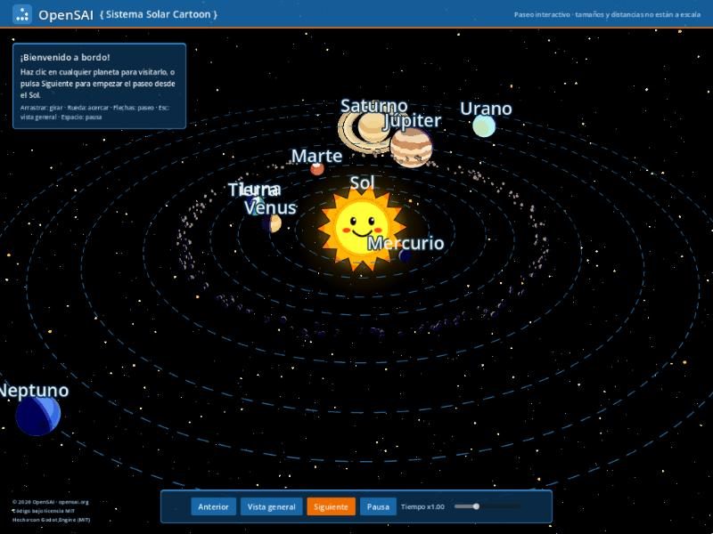
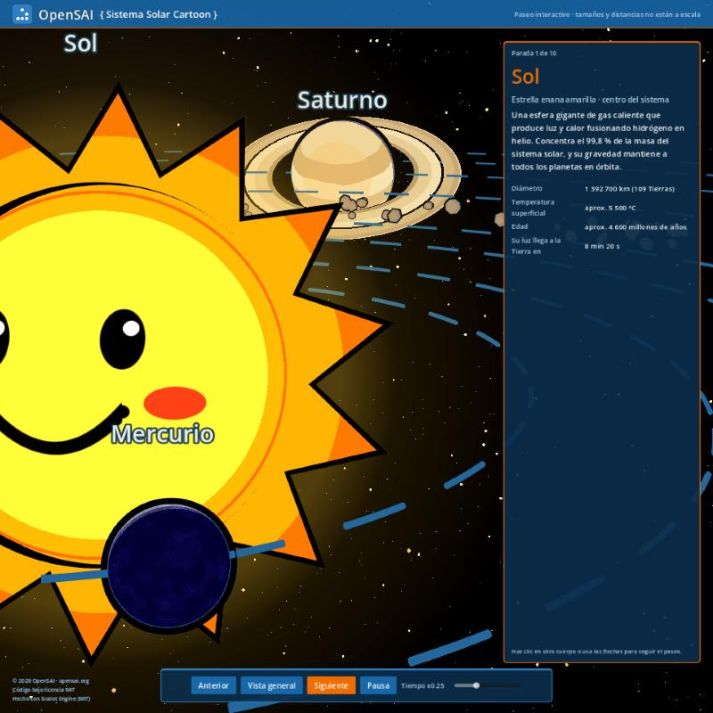
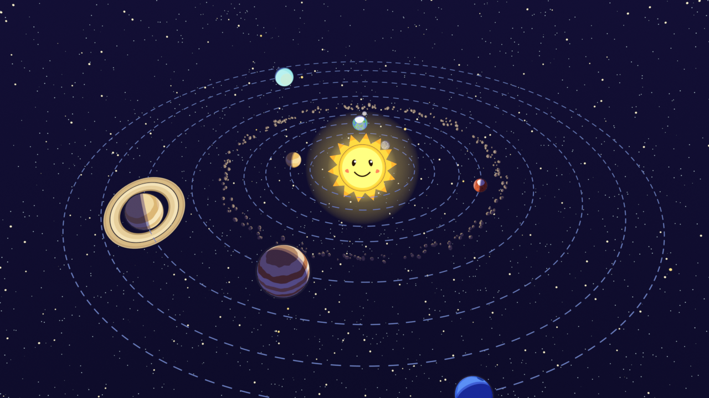

# { Cartoon Solar System }

Recorrido interactivo por un sistema solar de estilo caricatura. Selecciona
el Sol, la Luna o un planeta para conocer sus datos y explorar el conjunto.
La interfaz está en español de Colombia; los tamaños y las distancias no
están a escala.

An interactive tour of a cartoon solar system, by
[OpenSAI](https://opensai.org). Click a planet, the Moon, or the Sun, and the
camera flies to it and shows a fact card with real data. The arrow keys step
through the tour in order, from the Sun out to Neptune.



Sizes and distances are not to scale; the style comes first. The fact cards do
use real data.

**Language:** the brief introduction above is in Colombian Spanish;
the full documentation below is in US English. All text inside the game,
including the interface, labels, and fact cards, is in Colombian Spanish
(es_CO), in both the web build and the desktop executable.

## Contents

| Folder | What it holds |
|---|---|
| [`godot/`](godot/) | Godot 4.7 project: scene, scripts, shaders, and an automated test. Details in its [`README.md`](godot/README.md) |
| [`docs/`](docs/) | Exported web build (WebGL 2, no threads), ready for GitHub Pages |
| [`blender/`](blender/) | Script that builds the original scene in Blender 5.2, plus the resulting `.blend` |
| [`media/`](media/) | Screenshots for this README |

## Play

- **Online:** <https://open-source-academic-initiative.github.io/Solar/>
- **In a browser, locally:** serve the `docs/` folder over HTTP. It does not load from
  `file://`:

  ```sh
  python3 -m http.server 8060 --directory docs
  ```

  then open <http://localhost:8060>.
- **In the editor:** open `godot/project.godot` in Godot 4.7 and press F5.

| Control | Action |
|---|---|
| Click | Visit a body |
| ← → or *Anterior* / *Siguiente* (Previous / Next) | Step through the tour |
| Esc or *Vista general* (Overview) | Return to the full view |
| Drag / mouse wheel | Orbit / zoom |
| Space or *Pausa* (Pause) | Stop time |



## Export

`godot/export_presets.cfg` has two presets. Both need export templates that
match the editor version.

- **Web:** writes to `docs/`.
- **Linux:** builds a single x86_64 executable in `build/linux/`, which git
  ignores. That executable is published as a release.

## Blender origins

The scene started as a seamless 20-second looping animation in Blender 5.2,
with emission-only cel shading and inverted-hull outlines. The Godot project
reuses its radii, distances, turns per loop, axial tilts, and palettes,
converted from Z-up to Y-up.

`blender/build_solar_system.py` was written for the persistent session of a
Blender MCP server: it reads `BLENDER_MCP_ARTIFACTS_ROOT` and expects
`--output-dir`. `blender/sistema_solar_cartoon.blend` is the generated scene.



## License

MIT. See [`LICENSE`](LICENSE), which includes the Godot Engine notice that must
accompany every exported copy. The name "OpenSAI" is not covered by the
license.
